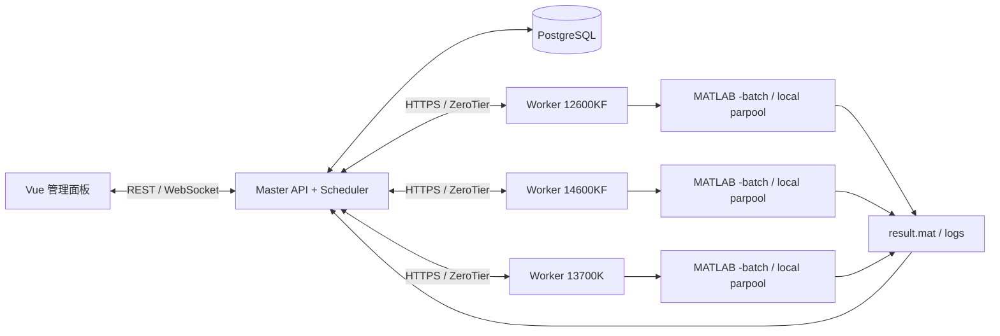
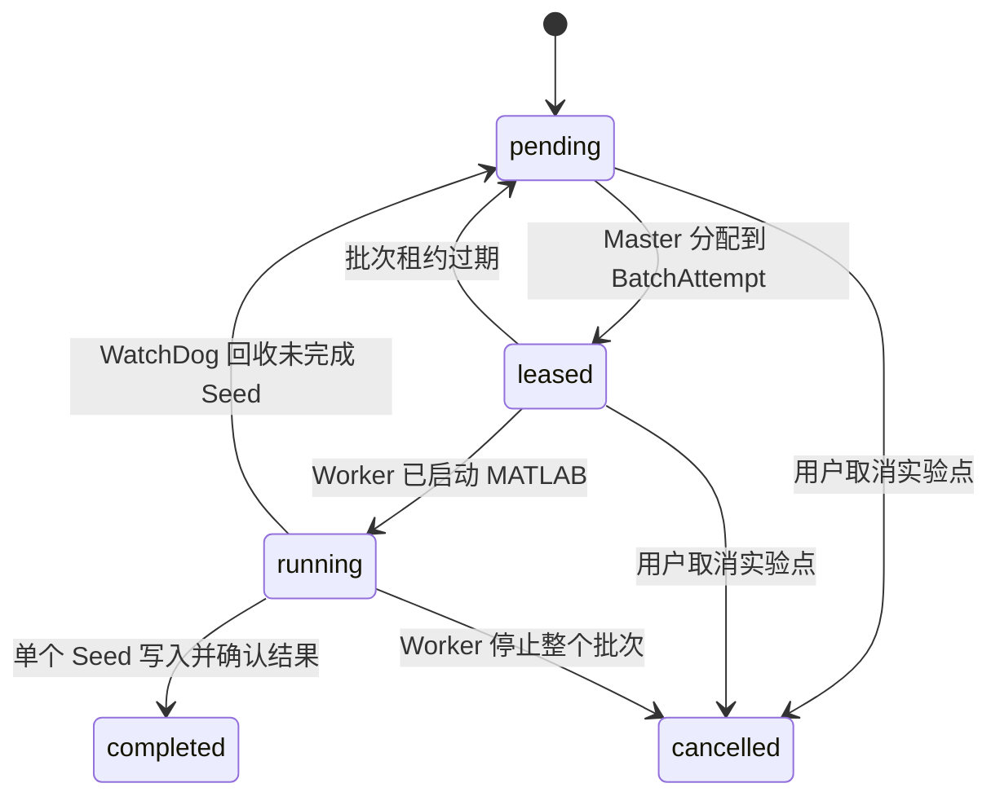

# 总体架构与数据模型

## 拓扑



## 任务层级

`Experiment` 是用户在界面保存或启动的一次实验配置；`ExperimentPoint` 是一个算法实例加一个问题实例；`SeedRun` 是可独立调度和回收的最小工作单元；`BatchAttempt` 是 Master 分给一个 Worker 的一组同属一个 ExperimentPoint 的 SeedRun。

```text
Experiment
  ├─ ExperimentPoint: 算法实例 A + 问题实例 P
  │  ├─ SeedRun 1 ... SeedRun 30（由 Master 全局管理）
  │  ├─ BatchAttempt A: Worker 1, Seed 1..10
  │  └─ BatchAttempt B: Worker 2, Seed 11..18
  └─ ExperimentPoint: 算法实例 B + 问题实例 P

任务数 = 算法实例数 × 问题实例数 × 每测试点运行次数
```

同一问题允许创建多个实例，例如 `SMOP1(theta=0.1, D=100)` 和 `SMOP1(theta=0.3, D=1000)` 必须是不同的 `problem_instance_id`，不能按问题名去重。

## PlatEMO 设置与已有数据

Master 在 PlatEMO 目录边界维护三种只读发现结果：

1. 算法/问题类目录：只接受文件名与 `classdef` 类名一致，且分别继承 `ALGORITHM`、`PROBLEM` 的 `.m` 文件。
2. `Data/Setting*.mat`：按 PlatEMO GUI 的 `Setting`/`Environment` 格式解析为可编辑实例；问题参数严格按 GUI 的 `N`、`M`、`D`、`maxFE` 再加类注释参数的顺序消费。
3. `Data/<Algorithm>/<Algorithm>_<Problem>_M<M>_D<D>_<run>.mat`：按算法、问题、M、D 聚合为“已有数据测试”。用户选择后仅创建相同问题规模的**新问题实例**，不会篡改或覆盖既有结果。

Master 原生导出的 MAT 采用 `PlatEMO_HPC_SettingsJSON`，用于再次导入本平台。它支持问题实例重复，因此不试图生成 PlatEMO 可加载的 `Setting.mat`。

## 核心实体

| 实体 | 关键字段 |
| --- | --- |
| `worker` | `id`、名称、ZeroTier URL、优先级、能力、状态、最后心跳、失败次数 |
| `worker_capacity` | CPU 核数、内存、GPU、可用槽位、MATLAB 版本、PlatEMO Git commit |
| `experiment` | 名称、Settings MAT、算法实例、问题实例、运行次数、保留数据点数、创建人 |
| `algorithm_instance` | 算法类名、参数 JSON、排序号 |
| `problem_instance` | 问题类名、M/D/自定义参数 JSON、排序号 |
| `experiment_point` | 实验 ID、算法实例、问题实例、参数快照、状态 |
| `seed_run` | ExperimentPoint ID、seed、状态、当前 BatchAttempt、FE、总 FE、结果路径、租约到期时间 |
| `batch_attempt` | ExperimentPoint ID、Worker ID、Seed 集合、开始/结束、lease token、MATLAB PID、pool 状态、错误、日志路径 |
| `artifact` | ExperimentPoint ID、Seed、BatchAttempt ID、类型、文件名、哈希、大小、存储路径 |
| `event` | 时间、事件类型、实体、JSON 负载，用于 UI 和审计 |

## 状态机



状态迁移必须写事务日志。Seed 重试不覆盖旧 BatchAttempt；每次重新分配创建新 BatchAttempt。

## 调度策略

可参与调度的 Worker 必须同时满足：`online`、心跳新鲜、可用槽位大于零、PlatEMO 版本兼容、资源标签匹配。

排序规则建议：

1. 实验对所有环境兼容且未暂停接单的 Worker 可见。
2. Worker 手工优先级，数值越大越优先。
3. 当前占用槽位/总槽位比，低者优先。
4. 近五分钟失败率，低者优先。
5. 同分时轮询，避免长期偏置。

实验不设 Worker 白名单或每实验 Worker 上限。Master 依据 Worker 上报的 `max_seeds_per_batch` 签发 Seed 批次；Worker 在批内以本机 `parpool` 执行。节点的人工调度仅通过“暂停接单/恢复接单”完成，暂停不影响已接受批次。
