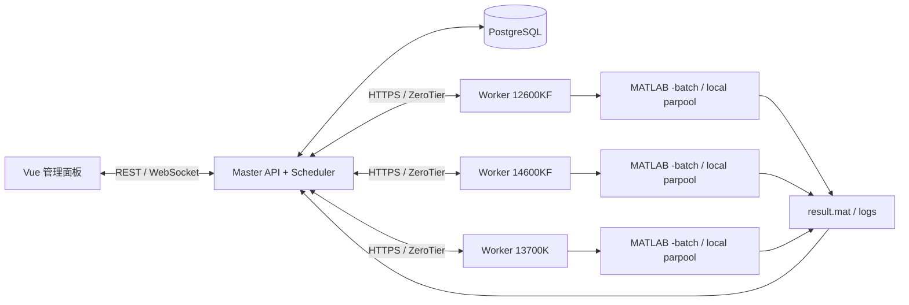
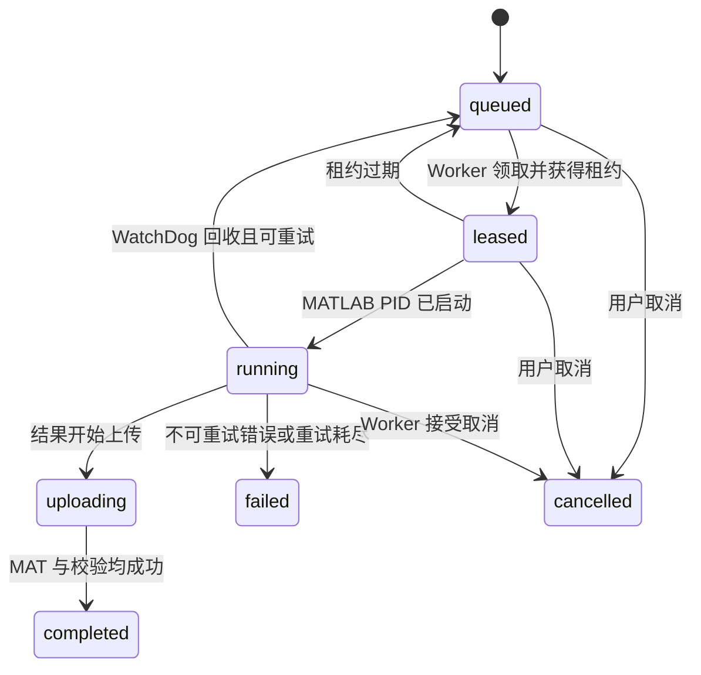

# 总体架构与数据模型

## 拓扑



## 任务层级

`Experiment` 是用户在界面保存或启动的一次实验配置；`Task` 是可独立调度的最小工作单元；`Attempt` 是该 Task 在一个 Worker 上的一次执行记录。

```text
Experiment
  ├─ 算法实例 A + 问题实例 P + seed 1 -> Task 1
  ├─ 算法实例 A + 问题实例 P + seed 2 -> Task 2
  └─ 算法实例 B + 问题实例 P + seed 1 -> Task 3

任务数 = 算法实例数 × 问题实例数 × 每测试点运行次数
```

同一问题允许创建多个实例，例如 `SMOP1(theta=0.1, D=100)` 和 `SMOP1(theta=0.3, D=1000)` 必须是不同的 `problem_instance_id`，不能按问题名去重。

## 核心实体

| 实体 | 关键字段 |
| --- | --- |
| `worker` | `id`、名称、ZeroTier URL、优先级、能力、状态、最后心跳、失败次数 |
| `worker_capacity` | CPU 核数、内存、GPU、可用槽位、MATLAB 版本、PlatEMO Git commit |
| `experiment` | 名称、Settings MAT、算法实例、问题实例、运行次数、最大 Worker 数、保留数据点数、创建人 |
| `algorithm_instance` | 算法类名、参数 JSON、排序号 |
| `problem_instance` | 问题类名、M/D/自定义参数 JSON、排序号 |
| `task` | 实验 ID、实例 ID、seed、优先级、状态、当前 attempt、结果路径、租约到期时间 |
| `attempt` | Task ID、Worker ID、开始/结束、FE、总 FE、ETA、PID、错误、日志路径 |
| `artifact` | Task ID、类型、文件名、哈希、大小、存储路径 |
| `event` | 时间、事件类型、实体、JSON 负载，用于 UI 和审计 |

## 状态机



状态迁移必须写事务日志。Task 重试不覆盖旧 Attempt；每次重试创建新 Attempt。

## 调度策略

可参与调度的 Worker 必须同时满足：`online`、心跳新鲜、可用槽位大于零、PlatEMO 版本兼容、资源标签匹配。

排序规则建议：

1. 用户选中的 Worker 集合与 `max_workers` 限制。
2. Worker 手工优先级，数值越大越优先。
3. 当前占用槽位/总槽位比，低者优先。
4. 近五分钟失败率，低者优先。
5. 同分时轮询，避免长期偏置。

`max_workers` 约束一次 Experiment 同时可使用的不同 Worker 数；它不是 MATLAB 本地 `parpool` 大小。Worker 自己根据其 `max_local_slots` 和任务内 seed 批次决定本地并发。

