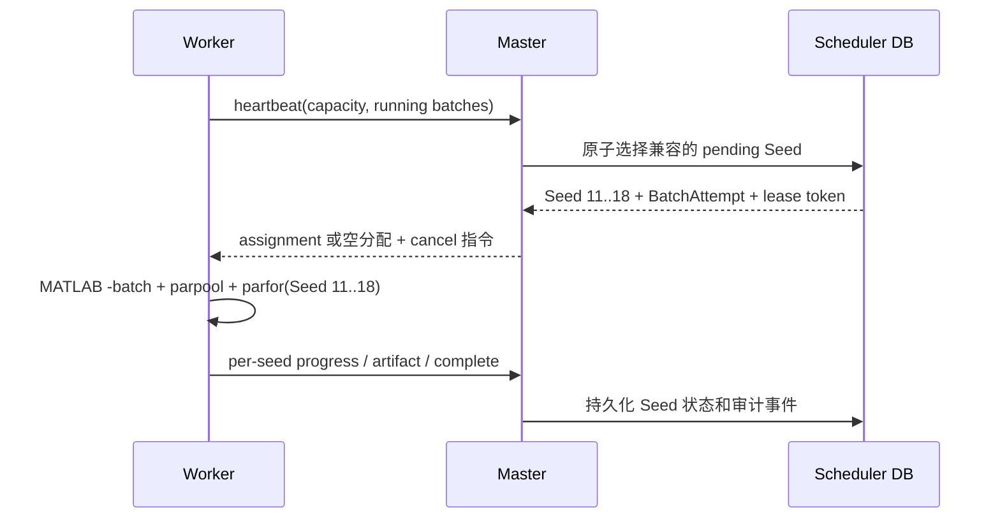

# 多 Worker Seed 批次调度对接方案

## 已确认约定

- 一个实验点是一个算法实例加一个问题实例及其不可变参数快照。
- 同一实验点的全部 Seed 由 Master 全局管理，不绑定到某个 Worker。
- 一个 Worker 同时仅运行一个 MATLAB 批次进程和一个本地 `parpool`。
- 一个批次只能包含同一实验点的多个 Seed；不同 Worker 可以同时执行同一实验点的不同 Seed 批次。
- Worker 主动连接 Master；Master 决定 Seed 分配。Master 不向 Worker 的 URL 主动推送任务。
- 取消粒度是 BatchAttempt；已完成 Seed 保留，未完成 Seed 可以回收和重新分配。

## 分配流程



Master 为一个实验点创建 30 个 Seed 时，Worker A、B、C 分别报告批次上限为 10、8、6，Master 可以签发 `[1..10]`、`[11..18]`、`[19..24]`。任一 Worker 完成后再领取剩余 `[25..30]`。分配数量为 `min(max_seeds_per_batch, 该实验点剩余 pending Seed)`；不能把运行中的 Seed 再次分给其他 Worker。

## Worker 心跳和响应

请求必须至少包含：

```json
{
  "available_batch_slots": 1,
  "max_concurrent_batches": 1,
  "configured_pool_workers": 10,
  "actual_pool_workers": 0,
  "max_seeds_per_batch": 10,
  "running_batches": []
}
```

运行中的批次将 `available_batch_slots` 报为 `0`，并上报 `batch_attempt_id`、`lease_token`、MATLAB PID、实际 pool 大小与每个 Seed 的进度。`configured_pool_workers` 由 MATLAB cluster profile 决定，Worker 不以配置文件覆盖它；`max_seeds_per_batch` 可以小于 pool 大小，用于限制单批运行时间。若 profile 探测失败或得到零 workers，Worker 必须报告零可用容量且拒绝 assignment。

Master 的响应：

```json
{
  "cancel_batch_attempt_ids": [],
  "assignment": {
    "batch_attempt_id": "uuid",
    "lease_token": "opaque-secret",
    "experiment_point_id": "uuid",
    "algorithm": {"name": "RVEA", "parameters": {}},
    "problem": {"name": "SMOP5", "parameters": {"N": 100, "M": 2, "D": 1000}},
    "seeds": [11, 12, 13, 14, 15, 16, 17, 18],
    "max_fe": 50000,
    "retain_points": 100,
    "cluster_profile": "local"
  }
}
```

无分配时 `assignment` 为 `null`。Master 必须在同一数据库事务内锁定 Seed、创建 BatchAttempt、生成 lease token，避免两台 Worker 获得相同 Seed。Worker 必须在一个心跳周期内以首个 `progress(phase=accepted/running)` 确认 assignment，或报告 `rejected` 和稳定错误码；未确认或拒绝时 Master 立即使该 BatchAttempt 失效并将全部未完成 Seed 恢复为 `pending`，不得等待长租约超时。

每个有效 progress 和运行中 heartbeat 都刷新批次的租约截止时间，并持久化 MATLAB PID、配置/实际 pool 大小和池摘要；WatchDog 只依据刷新后的截止时间判断失联。

## Master 必须实现

1. 数据模型：增加 `experiment_points`、Seed 级的 `seed_runs` 与 `batch_attempts`；移除实验创建时写入固定 `worker_id` 的逻辑。
2. 创建实验：为每个算法-问题实例生成全部 `pending` SeedRun，并保存 UI 选择的允许 Worker 集合和 `max_workers`。
3. 心跳调度器：根据节点在线状态、允许集合、能力兼容性、`max_workers`、优先级、占用率和轮询，选择待运行 Seed；通过心跳响应下发 `assignment`。
4. 原子租约：一个 Seed 同一时间只能归属一个有效 BatchAttempt；进度、完成和产物必须校验 `batch_attempt_id + lease_token`。
5. 状态与结果：分别持久化每个 Seed 的 FE、MaxFE、耗时、错误和结果；批次完成不覆盖已经完成的 Seed。
6. 接收确认、取消与回收：assignment 必须在一个心跳周期内收到 `accepted` 或 `rejected`；未确认或拒绝时立即回收。取消实验点时停止新分配并通知所有相关批次；`cancel_requested` 批次的完成请求无论声称何种汇总状态，都必须将未完成 Seed 标记为 `cancelled`。失联、进程失败或租约失效时只将未完成 Seed 恢复为 `pending`，排除失联节点一段退避期。
7. UI：任务卡按 Seed 显示实际执行节点、批次编号和进度；实验总览显示 pending、leased、running、completed、failed、cancelled 数量。
8. 审计与测试：记录 `seed.assigned`、`seed.reclaimed`、`batch.cancelled`；覆盖并发分配、重复上报、过期租约、失联回收和三个 Worker 分担 30 Seed 的集成测试。

## Worker 必须实现

1. 能力探测：启动时读取 MATLAB profile 的可用 pool 上限，注册和每次心跳报告批次容量及 `max_seeds_per_batch`。
2. 分配接收：只读取心跳响应的 `assignment`；对同一 `batch_attempt_id` 幂等，不重复启动 MATLAB。
3. 批次执行：为分配的 Seed 创建独立工作目录，启动一个 MATLAB 和一个指定 profile 的 `parpool`，通过 `parfor` 执行这批 Seed。
4. 进度：逐 Seed 发送 `queued/running/completed/failed/cancelled`、FE、MaxFE、耗时和错误；启动 pool 后上报实际 pool 大小。
5. 完成与产物：先以 `PUT /api/v1/artifacts/{artifact_id}` 上传每个已完成 Seed 的可恢复产物或批次聚合产物，再确认 BatchAttempt 完成。通信失败时保留文件，不创建第二个 MATLAB 批次。
6. 取消与失效：收到 `cancel_batch_attempt_ids` 或进度、产物、完成任一写入返回 `410` 时终止该 MATLAB 进程树，关闭 pool，并停止该租约的一切后续写入。仅在 Master 的用户取消指令中将未完成 Seed 报为 `cancelled`；进程失败或租约失效只报告未完成状态和错误，由 Master 恢复为 `pending`。
7. 重启恢复：仅重新上报可通过 PID 身份确认的 BatchAttempt；不得执行本地遗留 assignment JSON。无法确认的队列和目录保留给 Master 回收，绝不自行标记完成。

## 验收条件

1. 三个 Worker 的 `max_seeds_per_batch` 分别为 10、8、6 时，一个 30 Seed 实验点会被切分到至少两个 Worker，且不存在重复 Seed。
2. 单个 Worker 一次仅一个 MATLAB 进程和一个 `parpool`，批内 Seed 数不超过 Master 分配数量。
3. UI 能实时看到每个 Seed 的执行 Worker、FE/MaxFE、百分比、运行时长和 ETA。
4. 关闭一个 Worker 后，已完成 Seed 不重新执行，其余 Seed 在心跳超时后由其他节点完成。
5. 取消实验点会停止其所有运行批次且不再分配 pending Seed；取消后不接受旧 lease token 的进度、结果或完成请求。
